<p align="center">
  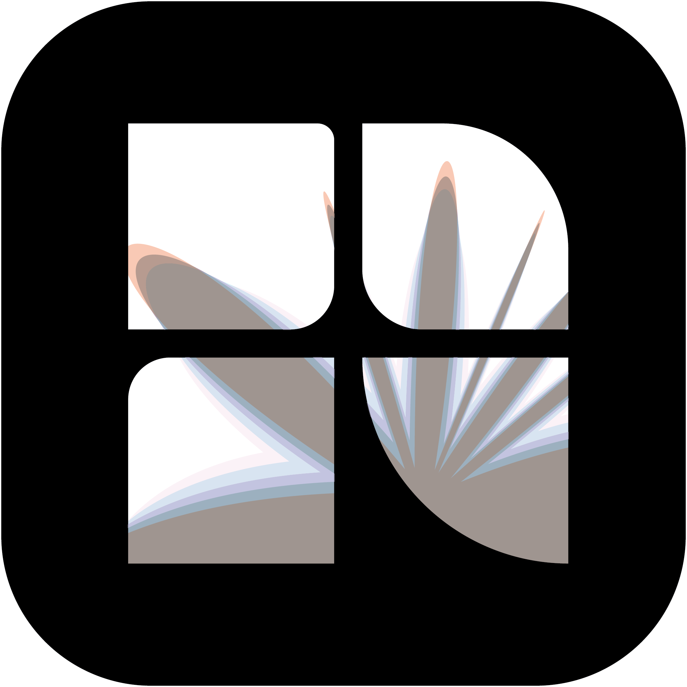
</p>

<h1 align="center">Kader</h1>
<p align="center">A fast, modern photo gallery for Linux — built with Qt 6, QML Material 3, and C++.</p>

---

## Screenshots

Demo library of freely licensed stock photos (see `tools/screenshots/`).

| | |
|---|---|
| 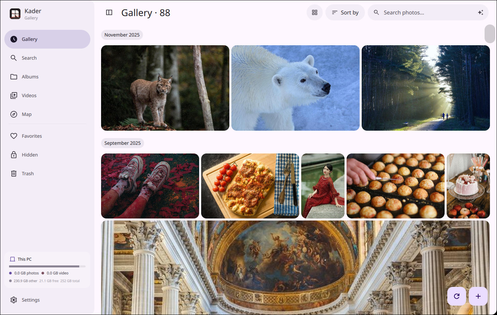 | 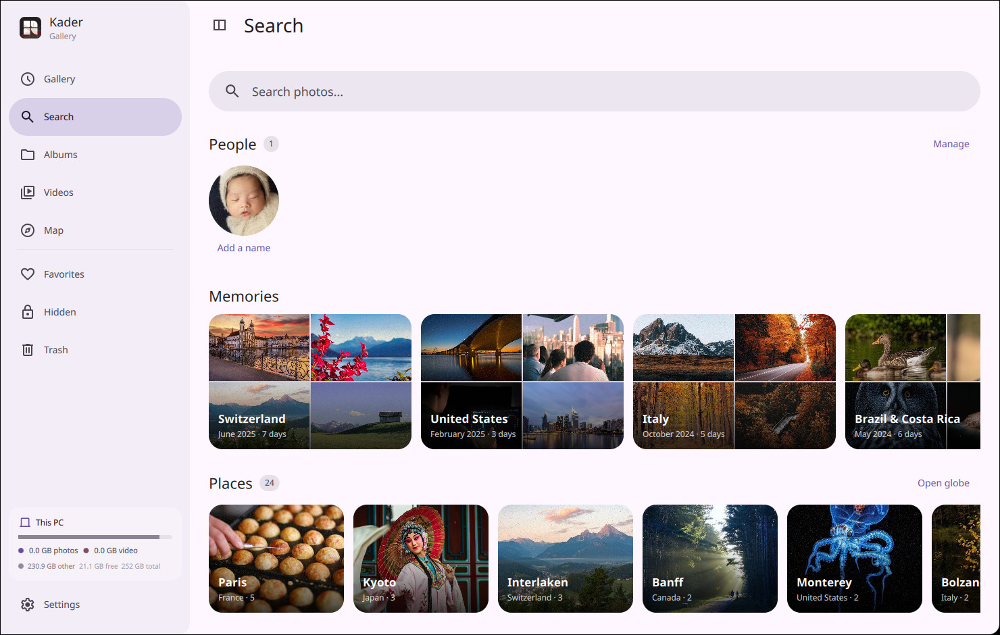 |
| Gallery: justified mosaic by month | Search: people, memories, places, colours |
| 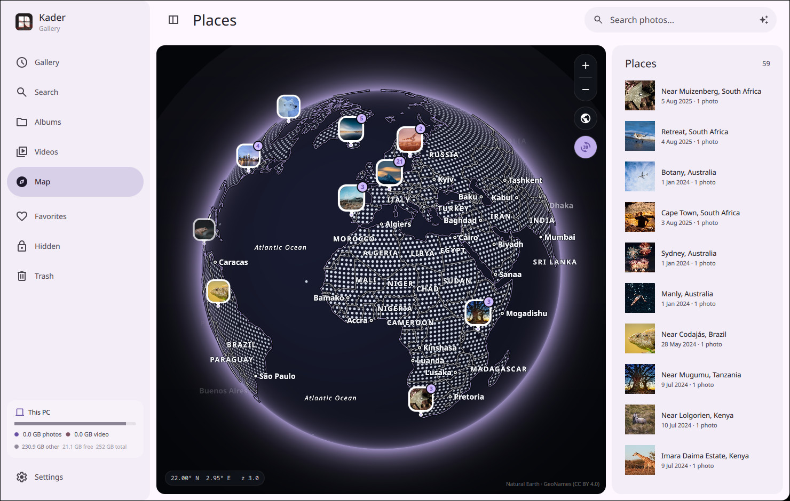 | 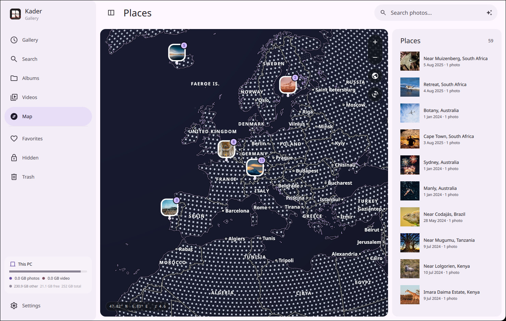 |
| Places globe with photo pins | Zoomed in: borders, countries, cities |
| 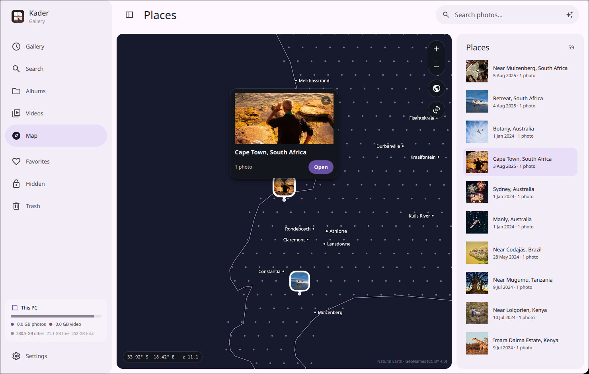 | 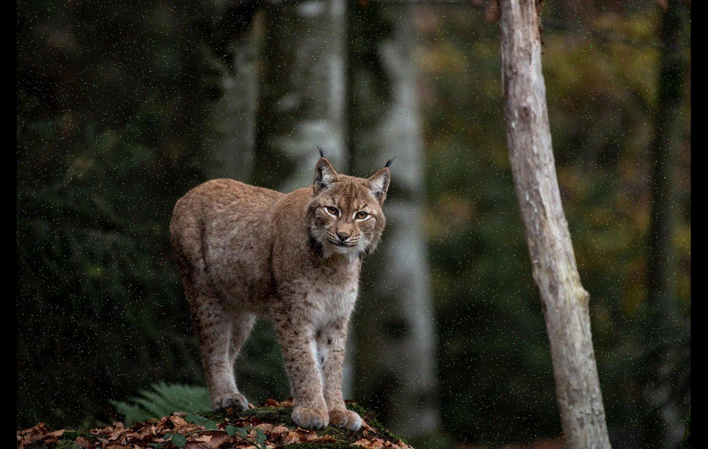 |
| Down to towns and suburbs | Viewer: the whole window is the photo |
| 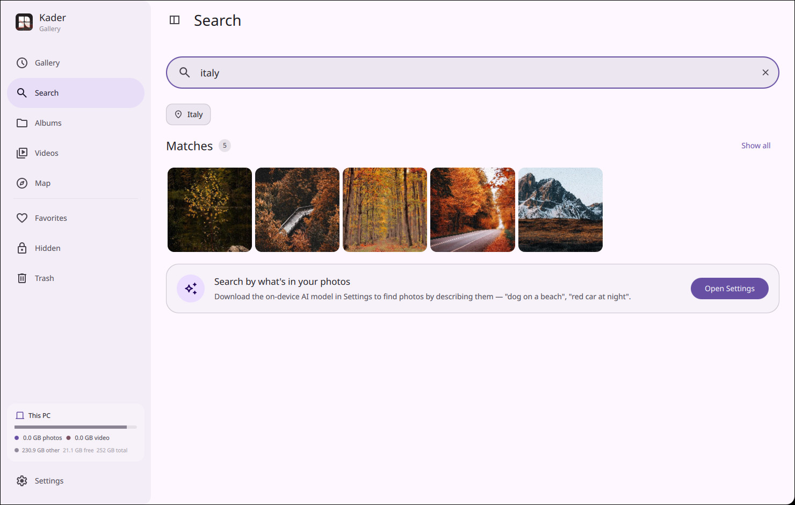 | 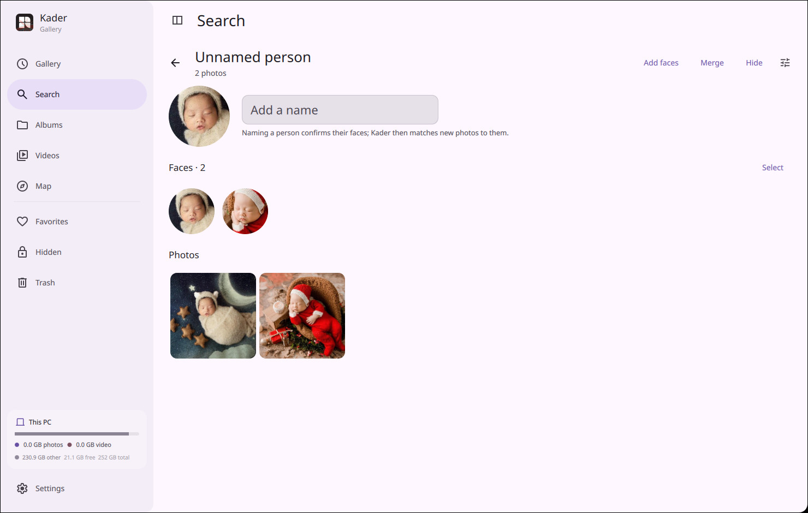 |
| One search box for places, people, colours, dates | People: faces grouped on-device |
| 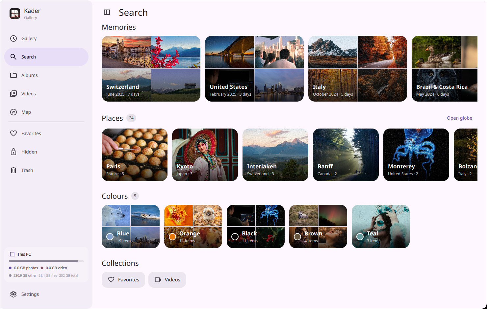 | 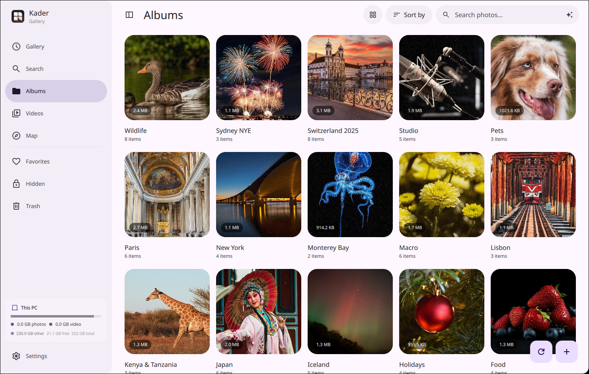 |
| Memories and colour groups | Albums |

## Features

- **Timeline** — mosaic grid with automatic monthly separators and variable density
- **Albums** — folder-based with pinning, custom covers, and virtual album creation
- **Videos** — dedicated view with an integrated player (FFmpeg backend), looping, volume, seeking
- **Places / Map** — geotagged photos plotted on an OpenStreetMap with reverse-geocoded pin cards
- **Favorites, Hidden, Trash** — smart views; hidden photos are password-protected
- **Viewer** — zoom/pan, EXIF info panel, keyboard navigation, fullscreen, copy to clipboard
- **RAW camera support** — thumbnail extraction via LibRaw for NEF, CR2, CR3, ARW, DNG, RAF and more
- **Encrypted thumbnails** — AES-256-CBC per-machine key, cached on disk
- **Fast scanning** — parallel directory walk using Linux `getdents64`, Exiv2 EXIF parsing, batch SQLite writes in WAL transactions
- **Storage overview** — sidebar card showing photos, video, and other disk usage

## Tech Stack

| Layer | Technology |
|---|---|
| UI | QML + Qt 6 Quick + [QmlMaterial](https://github.com/hypengw/QmlMaterial) |
| Backend | C++17, Qt 6 Core / Sql / Concurrent / Multimedia |
| Thumbnails | libvips (images), ffmpegthumbnailer (video), LibRaw (RAW) |
| Metadata | Exiv2 |
| Database | SQLite 3 (WAL mode) |
| Encryption | OpenSSL AES-256-CBC |

## Building

```bash
cmake -B build -DCMAKE_BUILD_TYPE=Release
cmake --build build -j$(nproc)
./build/kader
```

**Dependencies:** Qt 6 (Core Gui Qml Quick Sql Positioning Location Concurrent Multimedia), libvips, Exiv2, LibRaw, OpenSSL, ffmpegthumbnailer

On Arch Linux:
```bash
cd packaging/arch && makepkg -si
```

## Usage

```bash
kader                        # open gallery
kader /path/to/photo.jpg     # open a single file directly
kader file:///path/to/photo  # XDG / .desktop %U handler
```

## Dynamic Colors & Matugen

Kader supports dynamic theming out of the box. By toggling "Dynamic color" in the app's settings, Kader will automatically read Material 3 colors from `~/.local/state/quickshell/user/generated/material_colors.scss`. 

### Using with Matugen
To sync Kader's colors with your system wallpaper using [Matugen](https://github.com/InioX/matugen), you can create an SCSS template in your Matugen templates directory (e.g., `~/.config/matugen/templates/kader-colors.scss`) with the following variables:

```scss
$darkmode: true;
$primary: {{colors.primary.default.hex}};
$onPrimary: {{colors.on_primary.default.hex}};
$primaryContainer: {{colors.primary_container.default.hex}};
$onPrimaryContainer: {{colors.on_primary_container.default.hex}};
$secondary: {{colors.secondary.default.hex}};
$onSecondary: {{colors.on_secondary.default.hex}};
$secondaryContainer: {{colors.secondary_container.default.hex}};
$onSecondaryContainer: {{colors.on_secondary_container.default.hex}};
$tertiary: {{colors.tertiary.default.hex}};
$onTertiary: {{colors.on_tertiary.default.hex}};
$tertiaryContainer: {{colors.tertiary_container.default.hex}};
$onTertiaryContainer: {{colors.on_tertiary_container.default.hex}};
$error: {{colors.error.default.hex}};
$onError: {{colors.on_error.default.hex}};
$errorContainer: {{colors.error_container.default.hex}};
$onErrorContainer: {{colors.on_error_container.default.hex}};
$surface: {{colors.surface.default.hex}};
$surfaceDim: {{colors.surface_dim.default.hex}};
$surfaceBright: {{colors.surface_bright.default.hex}};
$surfaceContainerLowest: {{colors.surface_container_lowest.default.hex}};
$surfaceContainerLow: {{colors.surface_container_low.default.hex}};
$surfaceContainer: {{colors.surface_container.default.hex}};
$surfaceContainerHigh: {{colors.surface_container_high.default.hex}};
$surfaceContainerHighest: {{colors.surface_container_highest.default.hex}};
$onSurface: {{colors.on_surface.default.hex}};
$onSurfaceVariant: {{colors.on_surface_variant.default.hex}};
$outline: {{colors.outline.default.hex}};
$outlineVariant: {{colors.outline_variant.default.hex}};
$inverseSurface: {{colors.inverse_surface.default.hex}};
$inverseOnSurface: {{colors.inverse_on_surface.default.hex}};
$inversePrimary: {{colors.inverse_primary.default.hex}};
```

Then configure your `matugen.toml` to output it to Kader's watch path:

```toml
[templates.kader_gallery]
input_path = '~/.config/matugen/templates/kader-colors.scss'
output_path = '~/.local/state/quickshell/user/generated/material_colors.scss'
```

Kader parses both standard `camelCase` and `snake_case` tokens and will seamlessly update at runtime when Matugen generates new colors!
